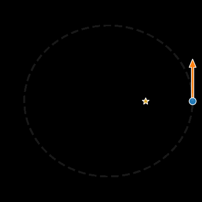
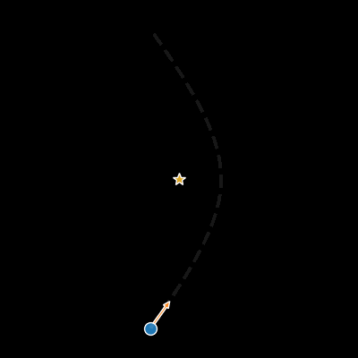

# Kepler Problem

Solution to the two body Kepler Problem in pure Haskell! Completely analytical (except for a series approximation for a couple of functions that are asymptotic at zero)!

Run with

    runhaskell EllipticalOrbit.hs
    python3 plot.py --iselliptical

or

    runhaskell HyperbolicOrbit.hs
    python3 plot.py --ishyperbolic

For the elliptical or hyperbolic cases respectively.
